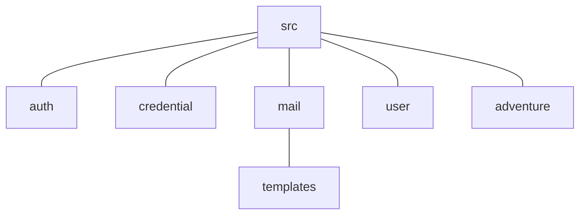

# The Bike Diary API
The backend component for the [Bike Diary](https://github.com/ericafenyo/bike-diary) application. The Bike Diary is a project for tracking and recording users cycling patterns and adventures.

## A summary of the code structure

